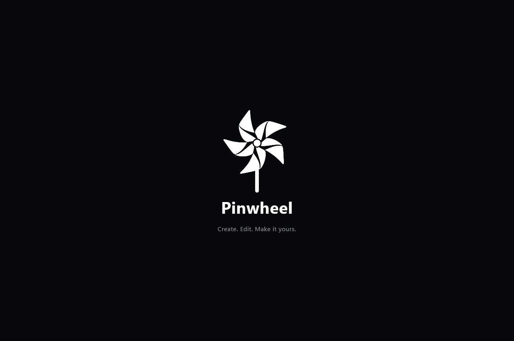
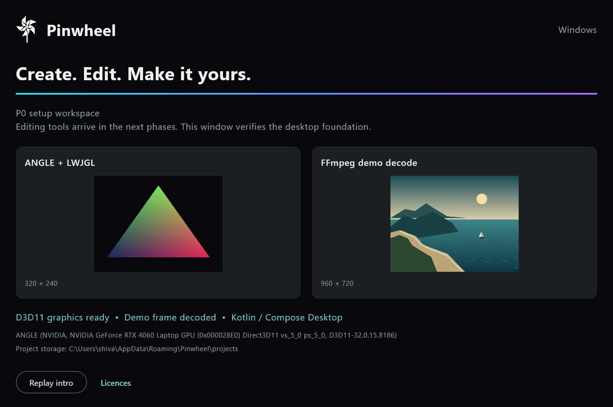
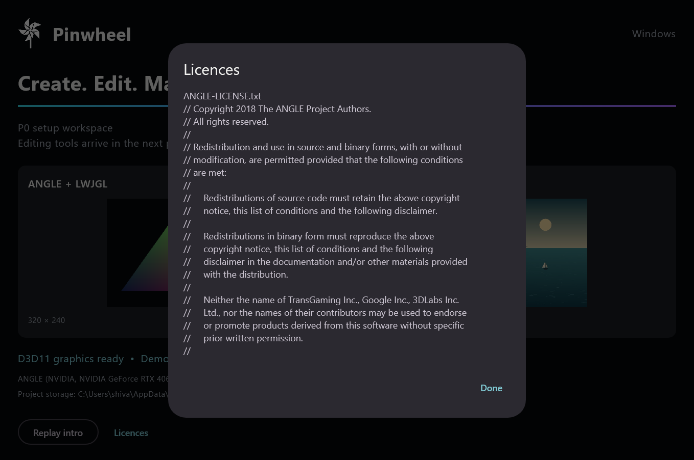

# Phase P0 report

P0 is complete: a clean Windows build, real Compose launch, ANGLE D3D11 triangle,
and real FFmpeg demo decode passed locally and in hosted Windows CI. This is
the setup foundation; editing and mobile visual parity remain pending.

Runtime commit: `cd9fa45` (startup-failure guard), preceded by `5d306c9`.
Setup commit: `44f423f`. All were pushed to
[ShivankXD/Pinwheel-windows](https://github.com/ShivankXD/Pinwheel-windows).
Commits use the owner's configured author and committer identity. No AI co-author
or generated-by trailers, and no em dashes, are added to commit messages.

## 1. What was built and where it lives

Windows repository: `D:/Pinwheel-Windows`.

| Module | P0 implementation | Location |
|---|---|---|
| pinwheel-core | Headless sRGB8, straight-alpha, top-down RGBA frame contract | `pinwheel-core/src/main/kotlin/com/pinwheel/core/RgbaFrame.kt` |
| pinwheel-platform | Windows project/original/cache/crash-report paths | `pinwheel-platform/src/main/kotlin/com/pinwheel/platform/AppPaths.kt` |
| pinwheel-render | EGL pbuffer, GLES shader compile/link, D3D11 triangle, readback and teardown using ANGLE/LWJGL | `pinwheel-render/src/main/kotlin/com/pinwheel/render/AngleTriangle.kt` |
| pinwheel-media | Pinned shared LGPL FFmpeg/ffprobe subprocess adapter with accurate demo-frame seek, output bounds and timeouts | `pinwheel-media/src/main/kotlin/com/pinwheel/media/FfmpegDecoder.kt` |
| pinwheel-photo | Empty module boundary reserved for P6 | `pinwheel-photo/README.md` |
| pinwheel-app | Compose dark theme, mobile intro geometry/timing, actual GPU/demo probes, intro replay and copied-notice dialog | `pinwheel-app/src/main/kotlin/com/pinwheel/app/Main.kt` |

Build scripts and checks are in `scripts/`; hosted CI is
`.github/workflows/windows.yml`. Native downloads have pinned source versions
and SHA-256 hashes in `native/dependencies.json`. Demo and fan copies are
byte-identical to mobile. Notices are in `licenses/` and visible in the app.
Architecture, source findings and written dependency/adapter choices are in
`ARCHITECTURE.md`, `P0-SOURCE-NOTES.md` and `NATIVE-DEPENDENCIES.md` beside this report.
No P1 editor logic or beyond-mobile implementation was added.

## 2. Tests run and results

Local commands:

```powershell
./scripts/bootstrap-native.ps1
./scripts/build.ps1 -Smoke
```

Final summary lines:

```text
TOTAL: tests=6 failures=0 errors=0 skipped=0
PASS Compose window opened and intro completed
PASS ANGLE (NVIDIA, NVIDIA GeForce RTX 4060 Laptop GPU (0x000028E0) Direct3D11 vs_5_0 ps_5_0, D3D11-32.0.15.8186)
PASS OpenGL ES 3.0.0 (ANGLE 2.1.24077 git hash: 367e9e74a865)
PASS FFmpeg decoded demo.mp4 at 1.000000 s: 960x720 RGBA
PASS licences dialog opened with copied notices
PASS screenshots captured directly from the app's Skia layer
BUILD SUCCESSFUL in 17s
28 actionable tasks: 28 executed
PASS missing-native smoke returns nonzero exit code with the expected library failure
```

Tests: `AppPathsTest` (1), `AngleTriangleTest` (2), `FfmpegDecoderTest` (3).
The graphics tests verify actual asymmetric pixels, Y orientation and release/recreation.
Media tests verify the shared LGPL flags, two different decoded times, unchanged
source SHA-256 and invalid-input rejection. No tests were skipped.
Core/photo/app have no P0 JUnit tests; the app has a separate real-window smoke run
and a deliberately missing-native-library failure check. The expected failing
child is validated as a successful negative check; it is not a remaining failure.

Full successful output: [clean-build-output.txt](../evidence/p0/clean-build-output.txt).
Native hashes/configuration: [native-hash-output.txt](../evidence/p0/native-hash-output.txt).
Raw JUnit XML and smoke summary are in `evidence/p0/`.

[Hosted Windows CI run 36973747235](https://github.com/ShivankXD/Pinwheel-windows/actions/runs/36973747235)
passed on runtime commit `cd9fa45`, including native bootstrap, clean build,
checks, actual Compose window launch, the expected startup-failure check and screenshot artifact upload. Its
public job/step result is saved in [ci-result.json](../evidence/p0/ci-result.json).
Local runtime was JDK 23; hosted CI used JDK 17.

Earlier failures were corrected:

- Two graphics checks initially failed because LWJGL rejected ANGLE's valid zero
  default display. The narrow JNI call fixes that ABI boundary.
  Full captured output: [initial-check-failure.txt](../evidence/p0/initial-check-failure.txt),
  [second-check-failure.txt](../evidence/p0/second-check-failure.txt),
  [raw initial failure XML](../evidence/p0/angle-initial-failure.xml).
- The screenshot API initially needed an explicit experimental opt-in:
  [full compile failure](../evidence/p0/screenshot-api-compile-failure.txt).
- The licence dialog dims the background; a too-strict screenshot assertion
  rejected its scrim: [full smoke output](../evidence/p0/licence-scrim-smoke-failure.txt).
  The assertion now permits the scrim, and the smoke harness exits on failure.
- Fault injection then caught Compose's default process exit masking startup
  failure. Automatic process exit is disabled so main rethrows the error, and
  timeout cancellation is treated as failure. The missing-library check now
  verifies nonzero exit both locally and in CI. Raw evidence before the fix:
  [native-failure-exit-regression.txt](../evidence/p0/native-failure-exit-regression.txt).
  Expected failure after the fix:
  [expected-native-failure.txt](../evidence/p0/expected-native-failure.txt).
- Earlier setup attempts included a Java-wrapper download timeout, missing EGL14
  imports, and unusable newest-snapshot DLL exports. Those console-only outputs
  were not retained as full files. The curl bootstrap, corrected imports and
  official working ANGLE snapshot resolve them. They are not hidden pass claims.
- A screen-coordinate capture picked up the covering window during verification.
  Those captures were discarded and overwritten before evidence was saved.
  The harness now captures only Pinwheel's Skia layer.

No mobile test, shader catalog golden test, playback/seek performance test,
export test, installer test or integrated-GPU budget is claimed.

## 3. Screenshots next to matching mobile screens

The following are actual rendered app surfaces, captured directly from Skia
after opening the Compose window. No other desktop window appears in them.

| New desktop screen | Matching mobile reference | Comparison status |
|---|---|---|
| [Startup intro](../evidence/p0/desktop-intro.png) | Current `ui/HomeKit.kt` intro source; matching current capture not found | Visual comparison pending owner reference |
| [P0 workspace](../evidence/p0/desktop-workspace.png) | No matching mobile diagnostic screen exists | P0 runtime evidence only |
| [Copied licences dialog](../evidence/p0/desktop-licences.png) | Current mobile settings/licences capture not supplied | Notice display verified; settings parity pending P7 |







Raw render evidence: [ANGLE triangle](../evidence/p0/angle-triangle.png) and
[demo frame at 1 s](../evidence/p0/demo-frame.png).
An older white mobile welcome screen was found, but it does not match this
startup screen. It is not substituted as parity evidence. Side-by-side current
mobile comparison remains explicitly pending; no device actions were taken.

## 4. Updated PARITY.md

[`PARITY.md`](../PARITY.md) has rows for every section 1.1 feature, the catalog
category groups and all fourteen regression invariants. Evidence-backed P0
foundation checks are marked complete. The startup intro and limited notice
dialog are partial; all editing/catalog features remain unported. No catalog
or mobile editing feature is marked at parity.

## 5. Open questions for the owner

1. Provide the Desktop-app Google OAuth client ID when sign-in work begins.
   The desktop flow will use loopback redirect and PKCE.
2. Choose desktop billing direction: Microsoft Store subscription, an
   account-linked entitlement backend, or both. Keep the same Free/Plus limits.
3. Supply current mobile startup/settings captures and Android reference renders
   at 0.3, 0.9, 1.5, 2.1 s, default parameters and the same sample images.
   Existing `writeContactSheets` uses different times. Producing device/emulator
   references remains owner-controlled; no test runs on the owner's phone.
4. Supply a couple of real mobile project JSON exports with all referenced media
   for P1 interoperability tests, including video and photo projects.
5. Keep the Windows 10 21H2 release target? The selected producer runtime supports
   22H2 and newer; P7 needs a compatible build for 21H2 or an explicit target change.

These questions do not block the completed P0 setup. Reference captures are
required before startup visual parity can be signed off.

## 6. Mobile repository unchanged

Before setup and at report verification:

```text
git -C "D:\Nativeoffice-photo&videoeditor" status --short
?? output/
```

Status is unchanged. Mobile was used only for read-only source/reference/asset
reads. The existing untracked `output/` folder was left alone. No mobile build,
git state change, phone or emulator action occurred.
Evidence: [mobile-status.txt](../evidence/p0/mobile-status.txt).
